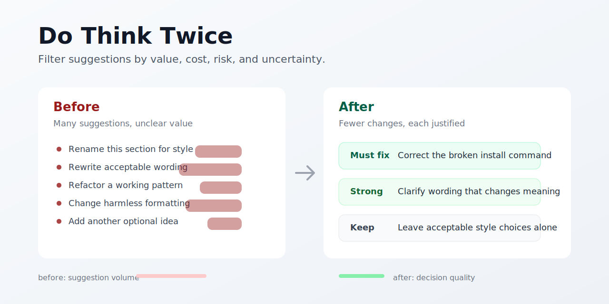

# Do Think Twice

[](https://github.com/eClip8e-coder/do-think-twice/tags)
[](LICENSE)


An instruction-only skill for Codex and Claude Code that makes an agent ask one practical question before suggesting a change:

> Is this actually better than keeping the original?



## Before / After

**Before:** The agent tries to be helpful by finding edits, rewrites, refactors, and polish opportunities even when the original is already good enough.

**After:** The agent separates real problems from taste, labels the value of each recommendation, and tells you when the best move is to keep the original.

That small discipline is useful for code review, writing feedback, academic revision, resume editing, SVG/layout edits, and strategy comparison. It reduces noisy advice without making the agent passive.

## What It Adds

Do Think Twice asks the agent to compare every proposed change against the option of doing nothing. A recommendation should survive this check:

- What exact problem does this solve?
- Is the problem real, or only a style preference?
- What is the benefit?
- What is the cost, risk, or uncertainty?
- Could the change introduce ambiguity, bugs, overclaiming, extra length, or style mismatch?
- Is the change aligned with the user's stated goal and constraints?

The skill classifies advice into four categories:

| Category | Meaning |
| --- | --- |
| Must fix | A real error, rule violation, misleading meaning, or blocker. |
| Strongly recommended | Clear improvement with low risk. |
| Optional | Minor improvement; the original is also acceptable. |
| Not recommended | Unnecessary, risky, or only a style preference. |

## Examples

The examples below show the difference between ordinary agent feedback and feedback guided by Do Think Twice:

- [Academic abstract revision](examples/academic-abstract.md)
- [Code refactor review](examples/code-refactor.md)
- [Resume bullet edit](examples/resume-bullet.md)
- [SVG label edit](examples/svg-label-edit.md)

Each example uses this format: user prompt, without Do Think Twice, with Do Think Twice, and why the second response is better.

## Install

Most users should install the skill globally so it is available in every project.

### Codex

```bash
npx skills add eClip8e-coder/do-think-twice -a codex -g -y
```

If your installer asks for a specific skill name, use:

```bash
npx skills add eClip8e-coder/do-think-twice --skill do-think-twice -a codex -g -y
```

After installation, invoke it by name:

```text
Use do-think-twice to review this paragraph.
Use do-think-twice to review this diff.
Use do-think-twice to tell me which edits are actually worth making.
```

You can also ask naturally:

```text
What should I change?
Is this better?
Review this, but do not invent issues.
Only suggest changes that are clearly worth it.
```

### Claude Code

Claude Code users can install the same skill globally:

```bash
npx skills add eClip8e-coder/do-think-twice -a claude-code -g -y
```

If your installer asks for a specific skill name, use:

```bash
npx skills add eClip8e-coder/do-think-twice --skill do-think-twice -a claude-code -g -y
```

After installation, invoke it by name:

```text
Use do-think-twice to review this diff.
```

Depending on your Claude Code skill setup, it may also be available as:

```text
/do-think-twice
```

## Manual Install

If you do not use the skills installer, copy the skill folder into your agent skills directory:

```text
skills/do-think-twice
```

For example, on Windows with Codex:

```powershell
git clone https://github.com/eClip8e-coder/do-think-twice.git
Copy-Item -Recurse .\do-think-twice\skills\do-think-twice "$env:USERPROFILE\.codex\skills\do-think-twice"
```

On macOS or Linux with Codex:

```bash
git clone https://github.com/eClip8e-coder/do-think-twice.git
mkdir -p ~/.codex/skills
cp -R do-think-twice/skills/do-think-twice ~/.codex/skills/do-think-twice
```

## Update

If installed with the skills installer:

```bash
npx skills update -g -y
```

If installed manually, pull the repository and copy `skills/do-think-twice` again.

## Project Layout

```text
do-think-twice/
|-- README.md
|-- LICENSE
|-- package.json
|-- assets/
|   |-- do-think-twice-preview.svg
|   `-- do-think-twice-preview.png
|-- examples/
|   |-- academic-abstract.md
|   |-- code-refactor.md
|   |-- resume-bullet.md
|   `-- svg-label-edit.md
`-- skills/
    `-- do-think-twice/
        |-- SKILL.md
        `-- agents/
            `-- openai.yaml
```

The skill is intentionally instruction-only. It has no scripts, build step, or runtime dependencies.

The preview image in `assets/` is for the README and GitHub social preview.

## Skill Contents

The actual agent instructions live here:

```text
skills/do-think-twice/SKILL.md
```

The UI metadata for compatible agents lives here:

```text
skills/do-think-twice/agents/openai.yaml
```

## Uninstall

If installed with the skills installer:

```bash
npx skills remove eClip8e-coder/do-think-twice -g
```

If installed manually for Codex, delete:

```text
~/.codex/skills/do-think-twice
```

## License

MIT License.
